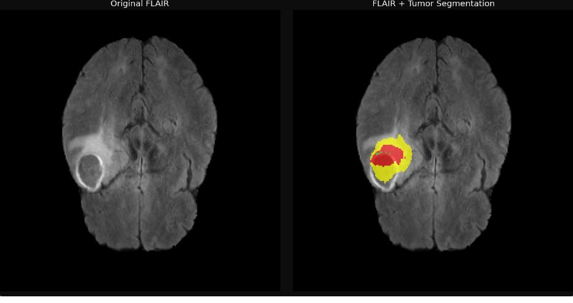
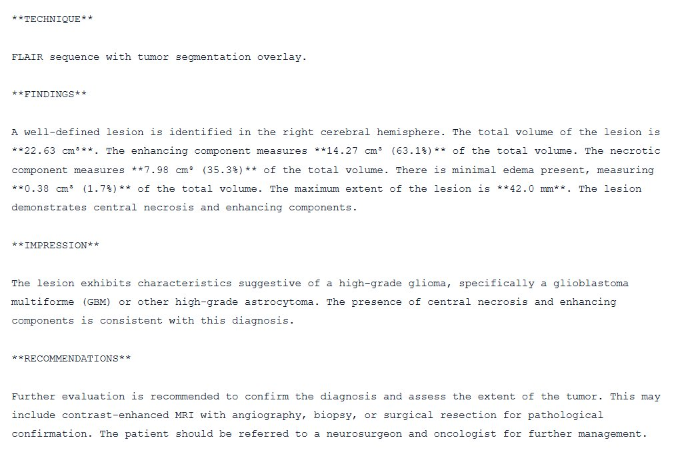
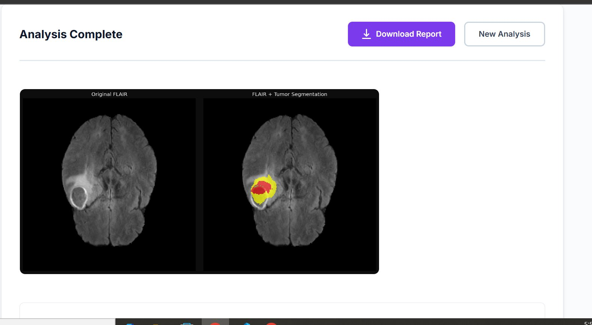
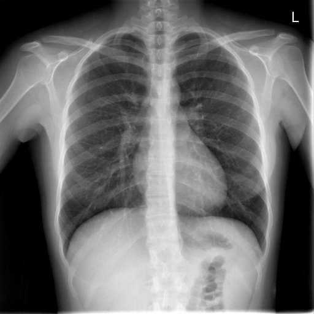

# RADIOS — AI-Driven Medical Image Analysis System

> An AI-powered multimodal medical imaging platform designed to assist radiologists with automated tumor segmentation and clinical report generation across Brain MRI and Chest X-Ray modalities.

---

## What is RADIOS?

RADIOS is a clinical diagnostic assistance platform built as a Final Year Project at FAST NUCES Karachi. It goes beyond traditional PACS systems by offering intelligent analysis, high-precision segmentation, and automated generation of structured radiology reports using state-of-the-art AI models.

The system accepts medical images from a radiologist, runs AI analysis, and returns annotated scans with a full structured clinical report — all through a clean web interface.

---

## Modalities Supported

| Modality | Input | Output |
|---|---|---|
| Brain MRI | 4 NIfTI files (FLAIR, T1, T1ce, T2) | Segmentation overlay + Clinical report |
| Chest X-Ray | JPEG / PNG image | Structured radiology report |

---

## MRI — Brain Tumor Analysis

### How it works

The radiologist uploads all 4 MRI modalities. The system runs an Attention U-Net to segment the tumor into 3 subregions, extracts quantitative clinical facts from the mask, and passes them to MedGemma 4B-it to generate a structured 4-section clinical report.

```
FLAIR + T1 + T1ce + T2
        ↓
  Attention U-Net
  (Tumor Segmentation)
        ↓
  extract_tumor_facts()
  (volumes, location, clinical flags)
        ↓
  MedGemma 4B-it
  (Structured Clinical Report)
        ↓
  Segmentation Overlay + Report
```

### Segmentation Output

The system produces a side-by-side view of the original FLAIR scan and the segmented overlay:

- 🟡 **Yellow** — Enhancing Tumor (active growing cells)
- 🔴 **Red** — Necrotic Core (dead center)
- 🟢 **Green** — Edema (surrounding brain swelling)



### Generated Clinical Report

MedGemma generates a structured 4-section report grounded entirely in quantitative segmentation facts — zero hallucinated values.



### Frontend



---

## Chest X-Ray Analysis

### How it works

The radiologist uploads a chest X-ray image. CheXagent-8b (fine-tuned on Indiana University Chest X-Ray dataset) generates a structured radiology report covering findings, impression, and recommendations.

```
Chest X-Ray (JPEG/PNG)
        ↓
  Fine-tuned CheXagent-8b
  (Report Generation)
        ↓
  Structured Radiology Report
```

### Sample Input



---

## System Architecture

The system follows a user-driven architecture. The radiologist selects the imaging modality through the web UI. The request is routed to the appropriate AI pipeline running on a Google Colab GPU backend exposed via ngrok. Results are returned as JSON and displayed in the React frontend.

```
React Frontend (Netlify)
        ↓  POST /analyze-mri or /analyze-xray
FastAPI Backend (Google Colab + ngrok)
        ↓
AI Models (Attention U-Net + MedGemma / CheXagent)
        ↓
JSON Response (overlay image + report)
        ↓
React Frontend displays results
```

---

## Dataset

| Modality | Dataset | Size |
|---|---|---|
| Brain MRI | BraTS 2020 | Multimodal MRI with expert segmentation masks |
| Chest X-Ray | Indiana University Chest X-Ray | 3,955 paired image-report samples |

---

## Team

| Name | Roll No |
|---|---|
| Nigarish Rehman Sarmad | 22K-8723 |
| Aman Ullah Kazi | 22K-8714 |
| Sehal Iqbal | 22I-0604 |

**Supervisor:** Mahrukh Khan — Lecturer, FAST NUCES KHI

**Co-Supervisor:** Dr. Muhammad Rafi — Professor & Department Head (AI & DS), FAST NUCES KHI


*FAST NUCES Karachi — Final Year Project 2026*
